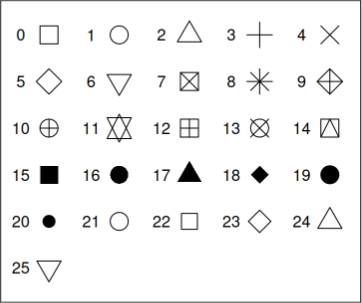

## Objectives {transition="zoom" transition-speed="slow"}
- Obtain and interpret appropriate graphical displays to assess conditions of the simple linear regression model
- Explain when a transformation is necessary by looking at appropriate graphical displays to assess conditions the two-sample t-methods (including pooled two-sample t-methods)
- Obtain output to perform a simple linear regression analysis.

## Activity
- A reminder to perform the reaction test so that data is available for next week to use
- Instructions on Lab 4A Notes
- My 3 times
  - 293 milliseconds
  - 251 milliseconds
  - 281 milliseconds
    - Average: 275 milliseconds

## [Simple Linear Regression - Assumptions]{.r-fit-text}
- Representative sample
- Independence
- Linearity condition
- Constant variance
- Normality condition

:::aside
Outliers are not a part of the assumptions per say but are important to identify (using scatterplot or residual plots)
:::

## [Simple Linear Regression - Assumptions]{.r-fit-text}
- Representative sample
  - How was the data collected?
  - Do we have a random sample of the correct population?
- Independence
  - How was the data collected?
- Linearity condition
  - Scatterplot
  - Residual plot
- Constant variance
  - Residual plot
- Normality condition
  - Normal probability plot of residuals

## Today's Example {transition="zoom" transition-speed="slow"}
**Question:** Can we use the size of a person’s head to predict the weight of their brain?

## Data {transition="zoom" transition-speed="slow"}
- The ` brainhead.txt` data set on Canvas
  - `headsize` Head size in $\text{cm}^3$
  - `brainwt` Brain weight (in grams)
  - Sample size, $n = 237$

## Data {transition="zoom" transition-speed="slow"}
```{r}
brainhead <- read.delim("C:/Users/Ghcto/OneDrive/Desktop/School/Spring 2024/ST 352 (TA)/Lab 4/brainhead.txt")
# brainhead <- read.delim("C:/Users/Ghcto/OneDrive/Desktop/Spring 2024/ST 352 (TA)/Lab 4/brainhead.txt")
brainhead
```

## Data {transition="zoom" transition-speed="slow"}
```{r}
brainhead[,3:4]
```

## Scatterplot Action {auto-animate=true}
```{r}
#| echo: TRUE
#| output-location: fragment
plot(brainwt ~ headsize, data = brainhead)
```

## Scatterplot Action {auto-animate=true}
```{r}
#| echo: TRUE
#| output-location: fragment
plot(brainwt ~ headsize, data = brainhead,
     pch = 19)
```

## Scatterplot Action {auto-animate=true}
```{r}
#| echo: TRUE
#| output-location: fragment
plot(brainwt ~ headsize, data = brainhead,
     pch = 19,
     col = "#49f5c4") # Picked using Google's "Color Picker"
```

## Scatterplot Action {auto-animate=true}
```{r}
#| echo: TRUE
#| output-location: fragment
plot(brainwt ~ headsize, data = brainhead,
     pch = 19,
     col = "#d14f65", # Picked using Google's "Color Picker"
     main = "Relationship Between Head Size and Weight of Brain")
     
```

## Scatterplot Action {auto-animate=true}
```{r}
#| echo: TRUE
#| output-location: fragment
plot(brainwt ~ headsize, data = brainhead,
     pch = 19,
     col = "#5fdb2e", # Picked using Google's "Color Picker"
     main = "Relationship Between Head Size and Weight of Brain",
     cex.main = 0.8)
```

## Scatterplot Action {auto-animate=true}
```{r}
#| echo: TRUE
#| output-location: fragment
plot(brainwt ~ headsize, data = brainhead,
     pch = 19,
     col = "#4c7bd9", # Picked using Google's "Color Picker"
     main = "Relationship Between Head Size and Weight of Brain",
     cex.main = 0.8,
     xlab = "Head Size (cm^3)")
```

## Scatterplot Action {auto-animate=true}
```{r}
#| echo: TRUE
#| output-location: fragment
plot(brainwt ~ headsize, data = brainhead,
     pch = 19,
     col = "#a22edb", # Picked using Google's "Color Picker"
     main = "Relationship Between Head Size and Weight of Brain",
     cex.main = 0.8,
     xlab = "Head Size (cm^3)",
     ylab = "Brain Weight (grams)")
```

## [Relevant Information from Scatterplot]{.r-fit-text}
- Checking linearity condition
- Checking for outliers

## Residual Plot Action {auto-animate="true" auto-animate-easing="ease-in-out"}
```{r}
#| echo: TRUE
# Step 1: Create a model
lmod <- lm(brainwt ~ headsize, data = brainhead)
```

## Residual Plot Action {auto-animate="true" auto-animate-easing="ease-in-out"}
```{r}
#| echo: TRUE
#| output-location: fragment
# Step 1: Create a model
lmod <- lm(brainwt ~ headsize, data = brainhead)

# Step 2: Use residuals from model to buid a plot
plot(lmod$residuals ~ brainhead$headsize)
```

## Plotting Character Options


## Residual Plot Action {auto-animate="true" auto-animate-easing="ease-in-out"}
```{r}
#| echo: TRUE
#| output-location: fragment
# Step 1: Create a model
lmod <- lm(brainwt ~ headsize, data = brainhead)

# Step 2: Use residuals from model to buid a plot
plot(lmod$residuals ~ brainhead$headsize,
     pch = 0:25) # Let's see all the plotting characters
```

## Residual Plot Action {auto-animate="true" auto-animate-easing="ease-in-out"}
```{r}
#| echo: TRUE
#| output-location: fragment
library(RColorBrewer)
# Step 2: Use residuals from model to buid a plot
plot(lmod$residuals ~ brainhead$headsize,
     pch = 19, # Back to one for clarity
     col = brewer.pal(5, "Paired")) # Build your own color palette!
```

## Residual Plot Action {auto-animate="true" auto-animate-easing="ease-in-out"}
```{r}
#| echo: TRUE
#| output-location: fragment
# Step 2: Use residuals from model to buid a plot
plot(lmod$residuals ~ brainhead$headsize,
     pch = 19,
     col = colorRampPalette(brewer.pal(5, "Dark2"))(25)) # Even more colors!
```

## Residual Plot Action {auto-animate="true" auto-animate-easing="ease-in-out"}
```{r}
#| echo: TRUE
#| output-location: fragment
# Step 2: Use residuals from model to buid a plot
plot(lmod$residuals ~ brainhead$headsize,
     pch = 19, 
     col = "#a68ced") # Back to one color for clarity
```

## Residual Plot Action {auto-animate="true" auto-animate-easing="ease-in-out"}
```{r}
#| echo: TRUE
#| output-location: fragment
# Step 2: Use residuals from model to buid a plot
plot(lmod$residuals ~ brainhead$headsize,
     pch = 19, 
     col = "#a68ced",
     main = "Residual Plot")
```

## Residual Plot Action {auto-animate="true" auto-animate-easing="ease-in-out"}
```{r}
#| echo: TRUE
#| output-location: fragment
# Step 2: Use residuals from model to buid a plot
plot(lmod$residuals ~ brainhead$headsize,
     pch = 19, 
     col = "#a68ced",
     main = "Residual Plot",
     xlab = "Head Size (cm^3)",
     ylab = "Residuals")
```

## Residual Plot Action {auto-animate="true" auto-animate-easing="ease-in-out"}
```{r}
#| echo: TRUE
#| output-location: fragment
# Step 2: Use residuals from model to buid a plot
plot(lmod$residuals ~ brainhead$headsize,
     pch = 19, 
     col = "#a68ced",
     main = "Residual Plot",
     xlab = "Head Size (cm^3)",
     ylab = "Residuals")
abline(h = 0) # Creating a horizontal line at 0
```

## [Relevant Information from Residual Plot]{.r-fit-text}
- Checking linearity condition
- Checking for outliers
- Constant variance condition

## [Normal Probability Plot of the Residuals]{.r-fit-text}
```{r}
#| echo: TRUE
#| output-location: fragment
qqnorm(lmod$residuals)
```

## [Normal Probability Plot of the Residuals]{.r-fit-text}
```{r}
#| echo: TRUE
#| output-location: fragment
qqnorm(lmod$residuals,
       pch = 19)
```

## [Normal Probability Plot of the Residuals]{.r-fit-text}
```{r}
#| echo: TRUE
#| output-location: fragment
qqnorm(lmod$residuals,
       pch = 19,
       col = "#17eb85")
```

## [Normal Probability Plot of the Residuals]{.r-fit-text}
```{r}
#| echo: TRUE
#| output-location: fragment
qqnorm(lmod$residuals,
       pch = 19,
       col = "#17eb85",
       main = "Normal Probability Plot of Residuals")
```

## [Normal Probability Plot of the Residuals]{.r-fit-text}
```{r}
#| echo: TRUE
#| output-location: fragment
qqnorm(lmod$residuals,
       pch = 19,
       col = "#17eb85",
       main = "Normal Probability Plot of Residuals")
qqline(lmod$residuals)
```

## [Normal Probability Plot of the Residuals]{.r-fit-text}
```{r}
#| echo: FALSE
# Comparing with real Normal data
par(mfrow = c(1,2))
qqnorm(lmod$residuals,
       pch = 19,
       col = "#17eb85",
       main = "Normal Probability Plot of Residuals")
qqline(lmod$residuals)

dat.norm <- rnorm(dim(brainhead)[1], 0, 100)
qqnorm(dat.norm,
     pch = 19,
     col = "#6517eb",
     main = "Simulated Normal Data")
qqline(dat.norm)
par(mfrow = c(1,1))
```

## [Relevant Information from Residual Plot]{.r-fit-text}
- Normality condition

## Obtaining Output from Model
```{r}
#| echo: TRUE
# Previously done
lmod <- lm(brainwt ~ headsize, data = brainhead)
```

## Obtaining Output from Model
```{r}
#| echo: TRUE
# Summary
summary(lmod)
```

## Obtaining Output from Model
```{r}
#| echo: TRUE
# Removes stars from output
options(show.signif.stars = FALSE)
```

## Obtaining Output from Model
```{r}
#| echo: TRUE
# New full output
summary(lmod)
```

## Obtaining Output from Model
```{r}
#| echo: TRUE
# Just coefficients
coef(summary(lmod))
```

```{r}
#| echo: FALSE
options(show.signif.stars = TRUE)
```

## [Using the Simple Linear Regression model for Prediction]{.r-fit-text}
```{r}
#| echo: TRUE
# Point estimate
predict(lmod, data.frame(headsize = 4000))
```

## [Using the Simple Linear Regression model for Prediction]{.r-fit-text}
```{r}
#| echo: FALSE
plot(brainwt ~ headsize, data = brainhead,
     pch = 19,
     col = "#0ecf88", # Picked using Google's "Color Picker"
     main = "Relationship Between Head Size and Weight of Brain",
     xlab = "Head Size (cm^3)",
     ylab = "Brain Weight (grams)")
abline(lmod, lwd = 2)
```

## [Using the Simple Linear Regression model for Prediction]{.r-fit-text}
```{r}
#| echo: FALSE
plot(brainwt ~ headsize, data = brainhead,
     pch = 19,
     col = "#0ecf88", # Picked using Google's "Color Picker"
     main = "Relationship Between Head Size and Weight of Brain",
     xlab = "Head Size (cm^3)",
     ylab = "Brain Weight (grams)")
abline(lmod, lwd = 2)
abline(v = 4000, lty = 2)
```

## [Using the Simple Linear Regression model for Prediction]{.r-fit-text}
```{r}
#| echo: FALSE
plot(brainwt ~ headsize, data = brainhead,
     pch = 19,
     col = "#0ecf88", # Picked using Google's "Color Picker"
     main = "Relationship Between Head Size and Weight of Brain",
     xlab = "Head Size (cm^3)",
     ylab = "Brain Weight (grams)")
abline(lmod, lwd = 2)
abline(v = 4000, lty = 2)
points(x = 4000, y = predict(lmod, data.frame(headsize = 4000))[[1]], 
       type = "p", cex = 1.5, col = "#420ecf", pch = 19)
```

## [Using the Simple Linear Regression model for Prediction]{.r-fit-text}
```{r}
#| echo: TRUE
#| output-location: fragment
# Prediction interval
predict(lmod, data.frame(headsize = 4000), interval = "prediction")
```

```{r}
#| echo: FALSE
plot(brainwt ~ headsize, data = brainhead,
     pch = 19,
     col = "#0ecf88", # Picked using Google's "Color Picker"
     main = "Relationship Between Head Size and Weight of Brain",
     xlab = "Head Size (cm^3)",
     ylab = "Brain Weight (grams)")
abline(lmod, lwd = 2)
# abline(v = 4000, lty = 2)
points(x = 4000, y = predict(lmod, data.frame(headsize = 4000))[[1]], 
       type = "p", cex = 1.5, col = "#420ecf", pch = 19)

prediction <- predict(lmod, data.frame(headsize = 4000), interval = "prediction")

lines(c(4000, 4000), c(prediction[2], prediction[3]), col = "#e84f4d", lwd = 2, lty = "dashed")
```

## [Using the Simple Linear Regression model for Prediction]{.r-fit-text}
```{r}
#| echo: TRUE
# Prediction interval
predict(lmod, data.frame(headsize = 4000), interval = "prediction")
```

```{r}
#| echo: FALSE
plot(brainwt ~ headsize, data = brainhead,
     pch = 19,
     col = "#0ecf88", # Picked using Google's "Color Picker"
     main = "Relationship Between Head Size and Weight of Brain",
     xlab = "Head Size (cm^3)",
     ylab = "Brain Weight (grams)")
abline(lmod, lwd = 2)
abline(v = 4000, lty = 2)
points(x = 4000, y = predict(lmod, data.frame(headsize = 4000))[[1]], 
       type = "p", cex = 1.5, col = "#420ecf", pch = 19)

predictions <- predict(lmod, newdata = data.frame(headsize = seq(2500, 4750, length = 2500)), 
                       interval = "prediction")

lines(seq(2500, 4750, length = 2500), predictions[,2], col = "#e84f4d", lty = 2)
lines(seq(2500, 4750, length = 2500), predictions[,3], col = "#e84f4d", lty = 2)
```

## [Using the Simple Linear Regression model for Prediction]{.r-fit-text}
```{r}
#| echo: TRUE
# Confidence intervals
predict(lmod, data.frame(headsize = 4000), interval = "confidence")
```

```{r}
#| echo: FALSE
plot(brainwt ~ headsize, data = brainhead,
     pch = 19,
     col = "#0ecf88", # Picked using Google's "Color Picker"
     main = "Relationship Between Head Size and Weight of Brain",
     xlab = "Head Size (cm^3)",
     ylab = "Brain Weight (grams)")
abline(lmod, lwd = 2)
abline(v = 4000, lty = 2)
points(x = 4000, y = predict(lmod, data.frame(headsize = 4000))[[1]], 
       type = "p", cex = 1.5, col = "#420ecf", pch = 19)

predictions.con <- predict(lmod, newdata = data.frame(headsize = seq(2500, 4750, length = 2500)), 
                       interval = "confidence")

lines(seq(2500, 4750, length = 2500), predictions.con[,2], col = "#e84f4d", lty = 2)
lines(seq(2500, 4750, length = 2500), predictions.con[,3], col = "#e84f4d", lty = 2)
```

## [Using the Simple Linear Regression model for Prediction]{.r-fit-text}
```{r}
#| echo: TRUE
# Confidence interval for slope coefficient
confint(lmod, "headsize", level = 0.95)
```

