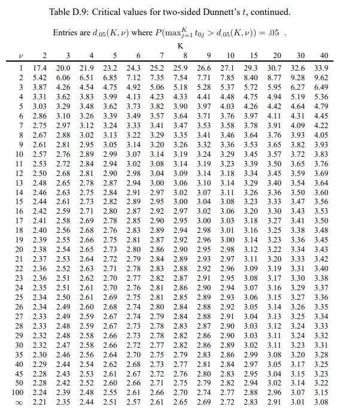

## Objectives {transition="zoom" transition-speed="slow"}
- Write Tukey-Kramer simultaneous confidence intervals for all pairwise comparisons.
- Use Dunnett’s procedure to compare all groups to a control group.
- Write a Scheffé confidence interval for a data-suggested comparison.
- Use a Bonferroni correction to write pre-planned simultaneous confidence intervals

## Who cares?
- Why should / do we care about accounting for multiple testing?
  - We want to make sure (increase the probability) our statistically significant results are not just by chance
  - We want to control our Type 1 error
    - The probability of rejecting the null hypothesis given it is true

## Loading packages {auto-animate="true" auto-animate-easing="ease-in-out"}
```{r}
#| echo: TRUE
library(Sleuth3)
library(ggplot2)
```

## Dataset
- `case0201` (Handicapped Data)
  - 70 observations
  - 2 variables
    - `Score`: is the score each student gave to the applicant
    - `Handicap`: is a factor variable with 5 levels—"None", "Amputee", "Crutches", "Hearing" and "Wheelchair"

## Dataset {auto-animate="true" auto-animate-easing="ease-in-out"}
```{r}
#| echo: TRUE
case0601
```
    
## ANOVA {auto-animate="true" auto-animate-easing="ease-in-out"}
```{r}
#| echo: TRUE
#| output-location: fragment
case0601_aov <- aov(Score ~ Handicap, data = case0601)
```

## ANOVA {auto-animate="true" auto-animate-easing="ease-in-out"}
```{r}
#| echo: TRUE
#| output-location: fragment
case0601_aov <- aov(Score ~ Handicap, data = case0601)
anova(case0601_aov)
```

## ANOVA {auto-animate="true" auto-animate-easing="ease-in-out"}
```{r}
#| echo: TRUE
#| output-location: fragment
case0601_aov <- aov(Score ~ Handicap, data = case0601)
summary(case0601_aov)
```

## Summary Statistics {auto-animate="true" auto-animate-easing="ease-in-out"}
```{r}
#| echo: TRUE
#| output-location: fragment
with(case0601, aggregate(Score ~ Handicap, FUN = mean))
```

## Summary Statistics {auto-animate="true" auto-animate-easing="ease-in-out"}
```{r}
#| echo: TRUE
#| output-location: fragment
with(case0601, aggregate(Score ~ Handicap, FUN = length))
```

## Tukey-Kramer
- Does simultaneous inference on all pairwise differences of means

$$
\bar{y}_{i\cdot} - \bar{y}_{j\cdot} \pm q_{\alpha_{F},\,g,\,N-g} \cdot s_{p}\sqrt{\frac{1}{n_{i}} + \frac{1}{n_{j}}}
$$

## Tukey-Kramer (Fun Trivia) {.smaller}

::: {.nonincremental}
- Studentized Range Distribution
  - This is the sampling distribution under the usual assumptions along with the assumption of $\mu_{1} = \cdots = \mu_{g}$ and balanced data
:::

$$
\begin{align*}
q & = \frac{\underset{i}{\text{max}}(\bar{y}_{i\cdot})}{\sqrt{MSE / n}} - \frac{\underset{i}{\text{min}}(\bar{y}_{i\cdot})}{\sqrt{MSE / n}} \\[0.25cm]
& = \text{Largest difference between studentized sample means}
\end{align*}
$$

:::aside
Recall $s_{p}^{2} = MSE$. (Note: This slide is more fun trivia, not something you'll be expected to know)
:::

## Tukey-Kramer {auto-animate="true" auto-animate-easing="ease-in-out"}
```{r}
#| echo: TRUE
qtukey(p = 0.95, nmeans = 5, df = 65) / sqrt(2)
```

## Tukey-Kramer

$$
\bar{y}_{i\cdot} - \bar{y}_{j\cdot} \pm 2.805824 \cdot s_{p}\sqrt{\frac{1}{n_{i}} + \frac{1}{n_{j}}}
$$

## Tukey-Kramer {auto-animate="true" auto-animate-easing="ease-in-out"}
```{r}
#| echo: TRUE
#| output-location: fragment
# We've got 5 choose 2 confidence intervals
TukeyHSD(case0601_aov)
```

## Cool Table? {auto-animate="true" auto-animate-easing="ease-in-out"}
```{r}
#| echo: TRUE
#| warning: FALSE
#| message: FALSE
#| results: asis
#| output-location: slide
library(xtable)
print(xtable(TukeyHSD(case0601_aov)$Handicap,
       caption = "95\\% Tukey Confidence Intervals"),
       comment = FALSE,
       caption.placement = "top",
       type = "html")
```

## Cool Table? {.smaller auto-animate="true" auto-animate-easing="ease-in-out"}
```{r}
#| echo: TRUE
#| output-location: slide
library(knitr)
library(kableExtra)
ktbl <- kable(TukeyHSD(case0601_aov)$Handicap,
              format = "html",
              caption = "95\\% Tukey Confidence Intervals",
              comment = FALSE,
              caption.placement = "top")
kable_styling(ktbl)
```

## Dunnett's Procedure 
- Compares all treatment groups to a control (or any other specified group)
- Different than comparing all pairwise combinations (like Tukey's)


## Dunnett's Procedure (Bonus Content)
$$
\bar{y}_{i} - \bar{y}_{g} \pm d_{\xi}(g-1, \nu)\sqrt{MSE}\sqrt{\frac{1}{n_{i}}+\frac{1}{n_{g}}}
$$

::: {.nonincremental}
- $\nu$ are the residual degrees of freedom
- $d_{\xi}(g-1, \nu)$ values are tabulated (shown in the next slide)
  - Note: These table values are exact when all sample sizes are equal and only approximate when the sizes are not equal
:::

## Dunnett's Procedure (Bonus Content)


## Dunnett's Procedure {auto-animate="true" auto-animate-easing="ease-in-out"}
```{r}
#| echo: TRUE
# How are the levels ordered? (Alphabetically)
summary(case0601$Handicap)
```

## Dunnett's Procedure {auto-animate="true" auto-animate-easing="ease-in-out"}
```{r}
#| echo: TRUE
# Let's change the level ordering
case0601$Handicap <- relevel(case0601$Handicap, ref = "None")
```

## Dunnett's Procedure {auto-animate="true" auto-animate-easing="ease-in-out"}
```{r}
#| echo: TRUE
# Checking we didn't mess up
summary(case0601$Handicap)
```

## Dunnett's Procedure {auto-animate="true" auto-animate-easing="ease-in-out"}
```{r}
#| echo: TRUE
# ANOVA round 2
case0601_aov <- aov(Score ~ Handicap, data = case0601)
```

## Dunnett's Procedure {auto-animate="true" auto-animate-easing="ease-in-out"}
```{r}
#| echo: TRUE
# install.packages("multcomp")
library(multcomp)
```

## Dunnett's Procedure {auto-animate="true" auto-animate-easing="ease-in-out"}
```{r}
#| echo: TRUE
#| output-location: fragment
glht(model = case0601_aov,
     linfct = mcp(Handicap = "Dunnett"),
     alternative = "two.sided",
     rhs = 0)
```

## Dunnett's Procedure {auto-animate="true" auto-animate-easing="ease-in-out"}
```{r}
#| echo: TRUE
case0601_glht <- glht(model = case0601_aov,
                      linfct = mcp(Handicap = "Dunnett"))
```

## Dunnett's Procedure {auto-animate="true" auto-animate-easing="ease-in-out"}
```{r}
#| echo: TRUE
case0601_glht <- glht(model = case0601_aov,
                      linfct = mcp(Handicap = "Dunnett"))
confint(case0601_glht)
```

## Cool Table? pt.2 {auto-animate="true" auto-animate-easing="ease-in-out"}
```{r}
#| echo: TRUE
#| warning: FALSE
#| message: FALSE
#| results: asis
#| output-location: slide
print(xtable(confint(case0601_glht)$confint,
       caption = "95\\% Dunnett's Confidence Intervals"),
       comment = FALSE,
       caption.placement = "top",
       type = "html")
```

## Scheffe Procedure 
::: {.nonincremental}
- Only multiple comparison method to control for data-suggested comparisons
  - This is because Scheffe's is appropriate for all possible linear contrasts
- This doesn't mean we always want to use it, since it is very conservative
:::

$$
\begin{align*}
\gamma & = C_{1}\mu_{1} + C_{2}\mu_{2} + \cdots + C_{g}\mu_{g} \\[0.25cm]
\text{Constraint: All } & C_{i}'s \text{ sum to 0 } \quad\Leftrightarrow\quad \sum\limits_{i=1}^{g}C_{i} = 0  
\end{align*}
$$


## Scheffe Procedure {auto-animate="true" auto-animate-easing="ease-in-out"}
```{r}
#| echo: TRUE
qf(p = 0.95, df1 = 4, df2 = 65)
```

$$
F_{4, 65}(0.95) = 2.51304
$$

## Scheffe Procedure 
Simultaneous $(1-\alpha)100\%$ Confidence Intervals:

$$
\hat{C}_{i} \pm \sqrt{(g-1)F_{\alpha,\, g-1,\, N-g}}\times SE(\hat{C}_{i})
$$

## Scheffe Procedure {auto-animate="true" auto-animate-easing="ease-in-out"}
```{r}
#| echo: TRUE
M <- sqrt(4 * qf(p = 0.95, df1 = 4, df2 = 65))
```

## Scheffe Procedure {auto-animate="true" auto-animate-easing="ease-in-out"}
```{r}
#| echo: TRUE
M
```

## Scheffe Procedure
Recall general format for most simultaneous confidence intervals

$$
\begin{align*}
g & = C_{1}\bar{y}_{1} + C_{2}\bar{y}_{2} + \cdots + C_{k}\bar{y}_{k} \\[0.25cm]
SE(g) & = s_{p}\sqrt{\frac{C_{1}^{2}}{n_{1}} + \frac{C_{2}^{2}}{n_{2}} + \cdots + \frac{C_{k}^{2}}{n_{k}}}
\end{align*}
$$


## Scheffe Procedure {auto-animate="true" auto-animate-easing="ease-in-out"}
```{r}
#| echo: TRUE
# Calculating SE
SE <- sqrt(2.6665) * sqrt((0.5)^2/14 + (0.5)^2/14 + (0.5)^2/14 + (0.5)^2/14)
```

## Scheffe Procedure {auto-animate="true" auto-animate-easing="ease-in-out"}
```{r}
#| echo: TRUE
# Calculating SE
SE <- sqrt(2.6665) * sqrt((0.5)^2/14 + (0.5)^2/14 + (0.5)^2/14 + (0.5)^2/14)

# Calculating lower bound, point estimate (g) minus our multiplier * standard error
lb <- (5.921429+5.342857 )/2 - (4.428571+4.05)/2 - M*SE
```

## Scheffe Procedure {auto-animate="true" auto-animate-easing="ease-in-out"}
```{r}
#| echo: TRUE
# Calculating SE
SE <- sqrt(2.6665) * sqrt((0.5)^2/14 + (0.5)^2/14 + (0.5)^2/14 + (0.5)^2/14)

# Calculating lower bound, point estimate (g) minus our multiplier * standard error
lb <- (5.921429+5.342857 )/2 - (4.428571+4.05)/2 - M*SE

# Calculating upper bound, point estimate (g) plus our multiplier * standard error
up <- (5.921429+5.342857 )/2 - (4.428571+4.05)/2 + M*SE
```

## Scheffe Procedure {auto-animate="true" auto-animate-easing="ease-in-out"}
```{r}
#| echo: TRUE
# Calculating SE
SE <- sqrt(2.6665) * sqrt((0.5)^2/14 + (0.5)^2/14 + (0.5)^2/14 + (0.5)^2/14)

# Calculating lower bound, point estimate (g) minus our multiplier * standard error
lb <- (5.921429+5.342857 )/2 - (4.428571+4.05)/2 - M*SE

# Calculating upper bound, point estimate (g) plus our multiplier * standard error
up <- (5.921429+5.342857 )/2 - (4.428571+4.05)/2 + M*SE

c(lb, up)
```

## Recall
```{r}
#| echo: TRUE
# Recall where these inputs can be found
with(case0601, aggregate(Score ~ Handicap, FUN = mean))
with(case0601, aggregate(Score ~ Handicap, FUN = length))
```


## Bonferroni Procedure
- Bonferroni is cool because it can be applied in many situations and it's fairly straightforward
  - The downsides are that 
    - we need to know the number of comparisons being performed in advanced
    - and it is often conservative

## Bonferroni Procedure {auto-animate="true" auto-animate-easing="ease-in-out"}
```{r}
#| echo: TRUE
# Creating our multiplier, by setting Bonferroni alpha to nominal alpha divided by k.
alpha <- 0.05/3
```

## Bonferroni Procedure {auto-animate="true" auto-animate-easing="ease-in-out"}
```{r}
#| echo: TRUE
alpha <- 0.05/3
M <- qt(1-alpha/2, df = 65)
```


## Bonferroni Procedure {auto-animate="true" auto-animate-easing="ease-in-out"}
```{r}
#| echo: TRUE
# First interval calculations
# Point estimate
point.est <- 4.9 - (4.428571+5.921429+4.05+5.342857)/4
```

## Bonferroni Procedure {auto-animate="true" auto-animate-easing="ease-in-out"}
```{r}
#| echo: TRUE
# Point estimate
point.est <- 4.9 - (4.428571+5.921429+4.05+5.342857)/4

# Standard error
SE <- sqrt(2.6665)*sqrt(1/14 + 4*(0.25)^2/14)
```

## Bonferroni Procedure {auto-animate="true" auto-animate-easing="ease-in-out"}
```{r}
#| echo: TRUE
# Point estimate
point.est <- 4.9 - (4.428571+5.921429+4.05+5.342857)/4

# Standard error
SE <- sqrt(2.6665)*sqrt(1/14 + 4*(0.25)^2/14)

# Lower bound
lb <- point.est - M*SE
```

## Bonferroni Procedure {auto-animate="true" auto-animate-easing="ease-in-out"}
```{r}
#| echo: TRUE
# Point estimate
point.est <- 4.9 - (4.428571+5.921429+4.05+5.342857)/4

# Standard error
SE <- sqrt(2.6665)*sqrt(1/14 + 4*(0.25)^2/14)

# Lower bound
lb <- point.est - M*SE

# Upper bound
up <- point.est + M*SE
```

## Bonferroni Procedure {auto-animate="true" auto-animate-easing="ease-in-out"}
```{r}
#| echo: TRUE
# Point estimate
point.est <- 4.9 - (4.428571+5.921429+4.05+5.342857)/4

# Standard error
SE <- sqrt(2.6665)*sqrt(1/14 + 4*(0.25)^2/14)

# Lower bound
lb <- point.est - M*SE

# Upper bound
up <- point.est + M*SE

# CI
c(lb, up)
```

## Bonferroni Procedure {auto-animate="true" auto-animate-easing="ease-in-out"}
```{r}
#| echo: TRUE
# Interval 2 Calculations
# Point estimate
point.est <- 4.05 - (4.428571 + 5.921429 + 5.342857)/3
# Standard error
SE <- sqrt(2.6665)*sqrt(1/14 + 3*(1/3)^2/14)
# Lower bound
lb <- point.est - M*SE
# Upper bound
up <- point.est + M*SE
# CI
c(lb, up)
```

## Bonferroni Procedure {auto-animate="true" auto-animate-easing="ease-in-out"}
```{r}
#| echo: TRUE
# Interval 3 Calculations
# Point estimate
point.est <- 5.921429 - (4.428571 + 4.050000 + 5.342857)/3
# Standard error
SE <- sqrt(2.6665)*sqrt(1/14 + 3*(1/3)^2/14)
# Lower bound
lb <- point.est - M*SE
# Upper bound
up <- point.est + M*SE
# CI
c(lb, up)
```

## Cool Table? pt.3 {auto-animate="true" auto-animate-easing="ease-in-out"}
```{r}
#| echo: TRUE
Bonf_table <- data.frame(row.names = c("None - Avg of others",
                                       "Hearing - Avg of Amputee, Crutches, and Wheelchair",
                                       "Crutches - Avg of Amputee, Hearing, and Wheelchair"),
                         lwr = c(-1.23, -2.42, 0.08),
                         upr = c(1.16, 0.06, 2.55))
Bonf_table
```

## Cool Table? pt.3 {auto-animate="true" auto-animate-easing="ease-in-out"}
```{r}
#| echo: TRUE
#| warning: FALSE
#| message: FALSE
#| results: asis
#| output-location: slide
Bonf_table <- data.frame(row.names = c("None - Avg of others",
                                       "Hearing - Avg of Amputee, Crutches, and Wheelchair",
                                       "Crutches - Avg of Amputee, Hearing, and Wheelchair"),
                         lwr = c(-1.23, -2.42, 0.08),
                         upr = c(1.16, 0.06, 2.55))
print(xtable(Bonf_table,
             caption = "95\\% Bonferroni Confidence Intervals"),
      comment = FALSE,
      caption.placement = "top",
      type = "html")
```

## Bonferroni Everywhere???
- Super general use
- We could have used Bonferroni for the 10 pairwise comparisons earlier
  - Although Tukey's is designed for pairwise comparisons and therefore yields shorter confidence intervals
  
## [Bonferroni Multiple Comparison Method (Bonus Content)]{.r-fit-text}
Can use Boneferroni to adjust $p$-value also
$$
\text{Reject } H_{0} \text{ if } \\[0.25cm]
p < \frac{\alpha}{k} \quad\Rightarrow\quad k \times p < \alpha
$$

:::aside
Where $k$ is the number of pairwise comparisons, $p$ is our p-value, $\alpha$ is our significance level
:::

## [Bonferroni Multiple Comparison Method (Bonus Content)]{.r-fit-text}
$$
\text{Reject } H_{0} \text{ if } \\[0.25cm]
p < \frac{0.05}{10} \quad\Rightarrow\quad 10 \times p < 0.05
$$

:::aside
Our specific problem numbers have been input
:::

## [Bonferroni Multiple Comparison Method (Bonus Content)]{.r-fit-text} {auto-animate="true" auto-animate-easing="ease-in-out"}
```{r}
#| echo: TRUE
# Un-adjusted p-values
pairwise.t.test(case0601$Score, case0601$Handicap, p.adjust.method = "none")
```

## [Bonferroni Multiple Comparison Method (Bonus Content)]{.r-fit-text} {auto-animate="true" auto-animate-easing="ease-in-out"}
```{r}
#| echo: TRUE
# Adjusted p-values
pairwise.t.test(case0601$Score, case0601$Handicap, p.adjust.method = "bonf")
```
