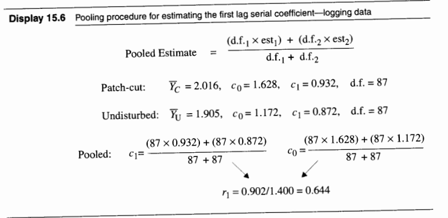

```{r}
#| echo: FALSE
setwd("C:/Users/Ghcto/OneDrive/Desktop/School/Year 2/Winter 2025/ST 512 (TA)/Labs/Lab 10")
```

## Lab Objectives
* Estimate the pooled first serial correlation coefficient.
* Adjust the standard error of a difference in means for serial correlation.
* Obtain a partial autocorrelation plot to diagnose time dependence.
* Use the Cochrane-Orcutt procedure to estimate regression coefficients in the presence of AR(1) autocorrelation.

## Loading Data and Packages {auto-animate="true" auto-animate-easing="ease-in-out"}
```{r}
#| echo: TRUE
library(Sleuth3)
library(ggplot2)
library(orcutt)
```

## Installing `orcutt` Package {.barelysmaller auto-animate="true" auto-animate-easing="ease-in-out"}
* To install the `orcutt` package, download the package from the course website.
* Then, run the following command to install the package.

:::fragment
```{r}
#| echo: TRUE
#| eval: FALSE
install.packages("orcutt_2.3.tar.gz", repos = NULL, type = "source")
```
:::

* You might run into the error `ERROR: dependency 'lmtest' is not available for package 'orcutt'`
* To fix this error, install the `lmtest` package using the following command.

:::fragment
```{r}
#| echo: TRUE
#| eval: FALSE
install.packages("lmtest")
```
:::

## Dataset {.smaller auto-animate="true" auto-animate-easing="ease-in-out"}
* `case1501` (Logging and Water Quality)
  * Data from an observational study of nitrate levels measured at three week intervals for five years in two watersheds. One of the watersheds was undisturbed and the other had been logged with a patchwork pattern.
  * 88 observations (rows)
  * 3 variables (columns)
    * `Week`: week after the start of the study
    * `Patch`: natural logarithm of nitrate level (ppm) in the logged watershed (ppm)
    * `NoCut`: natural logarithm of nitrate level in the undisturbed watershed (ppm)

## Viewing Data {auto-animate="true" auto-animate-easing="ease-in-out"}
```{r}
#| echo: TRUE
case1501
```

## [Calculating the pooled estimate of the first serial correlation coefficient]{.r-fit-text} {.smaller auto-animate="true" auto-animate-easing="ease-in-out"}
We assume the data from both watersheds follow an AR(1) model:

:::fragment
$$
\mathbb{E}[Y_t - \nu \mid Y_1, \dots, Y_{t-1}] = \alpha (Y_{t-1} - \nu)
$$
:::

* The first serial correlation coefficient, $\alpha$, is also called the **lag-1 autocorrelation**.  
* It measures the correlation between $Y_t$ and itself at a separation of one time step.
* Correlation is defined as:

  $$
  \rho = \frac{\text{cov}(Y_t, Y_{t-1})}{\sqrt{\text{var}(Y_t) \text{var}(Y_{t-1})}}.
  $$

* For an AR(1) process, we assume $\text{var}(Y_t) = \text{var}(Y_{t-1})$, simplifying to:

  $$
  \rho = \frac{\text{cov}(Y_t, Y_{t-1})}{\text{var}(Y_t)}.
  $$

* The pooled estimate of $\alpha$ is then given by:

  $$
  \hat{\alpha} = \frac{\sum_{t=2}^{T} (Y_t - \bar{Y}) (Y_{t-1} - \bar{Y})}{\sum_{t=1}^{T} (Y_t - \bar{Y})^2}.
  $$

## [Calculating the pooled estimate of the first serial correlation coefficient]{.r-fit-text} {.smaller auto-animate="true" auto-animate-easing="ease-in-out"}
* $\alpha$ is also known as the population first serial correlation coefficient thus it may be estimated by the sample first serial correlation coefficient denoted $\hat{\alpha} = r_{1}$. 

:::fragment
$$
r_{1} = \frac{c_{1}}{c_{0}} = \frac{\frac{1}{n-1}\sum\limits_{t=2}^{n}res_{t}\cdot res_{t-1}}{\frac{1}{n-1}\sum\limits_{t=1}^{n}res_{t}^{2}}
$$
:::

* notice that $res_{t}$ is just the deviation of observation $t$ from its estimated mean, in the case with no explanatory variables, we have

:::fragment
$$
res_{t} = Y_{t} - \bar{Y}
$$
:::

* $c_{0}$ is just the sample variance of the residuals and $c_{1}$ is the sample covariance of the residuals at lag 1

## [Calculating the pooled estimate of the first serial correlation coefficient]{.r-fit-text} {auto-animate="true" auto-animate-easing="ease-in-out"}
```{r}
#| echo: TRUE
acf_Patch <- acf(case1501$Patch, lag.max = 1, type = "covariance", plot = FALSE)$acf
acf_NoCut <- acf(case1501$NoCut,lag.max = 1, type = "covariance", plot = FALSE)$acf
```

## [Calculating the pooled estimate of the first serial correlation coefficient]{.r-fit-text} {auto-animate="true" auto-animate-easing="ease-in-out"}
```{r}
#| echo: TRUE
acf(case1501$Patch, lag.max = 1, type = "covariance", plot = FALSE)
acf(case1501$NoCut, lag.max = 1, type = "covariance", plot = FALSE)
```

## [Calculating the pooled estimate of the first serial correlation coefficient]{.r-fit-text} {.smaller auto-animate="true" auto-animate-easing="ease-in-out"}
* Each of these variables contains two elements:  
  - The first element is $\frac{(Y_t - \bar{Y})^2}{n}$, representing the sample variance.  
  - The second element is $\frac{(Y_t - \bar{Y})(Y_{t-1} - \bar{Y})}{n}$, representing the sample lag-1 autocovariance.  


## [Calculating the pooled estimate of the first serial correlation coefficient]{.r-fit-text} {.smaller auto-animate="true" auto-animate-easing="ease-in-out"}
Thus with each element we can create the following expression

$$
\frac{\frac{1}{n}\sum\limits_{t=2}^{n}(Y_{t} - \bar{Y})(Y_{t-1} - \bar{Y})}{\frac{1}{n}\sum\limits_{t=1}^{n}(Y_{t} - \bar{Y})^{2}}
$$

* Compare these expressions to the formulas on page 443 of *The Sleuth*:  
  - Our $Y_t - \bar{Y}$ corresponds to *The Sleuth’s* residual term.  
  - The denominator in these expressions is $n$, whereas *The Sleuth* uses $n - 1$.  
  - To compute sample variances and lag-1 autocovariances, adjust the denominator to $n - 1$.  
  - We can adjust as such
  
:::fragment
$$
\frac{\left(\frac{n}{n-1}\right)\frac{1}{n}\sum\limits_{t=2}^{n}(Y_{t} - \bar{Y})(Y_{t-1} - \bar{Y})}{\left(\frac{n}{n-1}\right)\frac{1}{n}\sum\limits_{t=1}^{n}(Y_{t} - \bar{Y})^{2}}
$$
:::  

* Thus

:::fragment
$$
r_{1} = \frac{c_{1}}{c_{0}} = \frac{\frac{1}{n-1}\sum\limits_{t=2}^{n}res_{t}\cdot res_{t-1}}{\frac{1}{n-1}\sum\limits_{t=1}^{n}res_{t}^{2}} = \frac{\frac{1}{n-1}\sum\limits_{t=2}^{n}(Y_{t} - \bar{Y})(Y_{t-1} - \bar{Y})}{\frac{1}{n-1}\sum\limits_{t=1}^{n}(Y_{t} - \bar{Y})^{2}}
$$
::: 

## [Calculating the pooled estimate of the first serial correlation coefficient]{.r-fit-text} {.smaller auto-animate="true" auto-animate-easing="ease-in-out"}
This is not a pooled estimate though like is used in the book 



## [Calculating the pooled estimate of the first serial correlation coefficient]{.r-fit-text} {.smaller auto-animate="true" auto-animate-easing="ease-in-out"}
* To find the standard error for the difference in averages of two time series we need a pooled estimate of the first serial correlation as shown on the previous slide.
* Since we are wanting a pooled estimate and only considering a two time points, we need no summations, thus we use the formulas


:::fragment
$$
c_{1}^{*} =  \frac{\left(\text{df}_{\text{patch}} \cdot \left(\frac{n}{n-1}\right)c_{\text{1, patch}}\right) + \left(\text{df}_{\text{nocut}} \cdot \left(\frac{n}{n-1}\right)c_{\text{1, nocut}}\right)}{\text{df}_{\text{patch}} + \text{df}_{\text{nocut}}}
$$
::: 

* where $c_{1}^{*}$ is the pooled lag-1 autocovariance

:::fragment
$$
c_{0}^{*} =  \frac{\left(\text{df}_{\text{patch}} \cdot \left(\frac{n}{n-1}\right)c_{\text{0, patch}}\right) + \left(\text{df}_{\text{nocut}} \cdot \left(\frac{n}{n-1}\right)c_{\text{0, nocut}}\right)}{\text{df}_{\text{patch}} + \text{df}_{\text{nocut}}}
$$
:::

* where $c_{0}^{*}$ is the pooled variance $s_{p}^{2}$

* where $c_{\text{0, nocut}}, c_{\text{1, nocut}}$ and $c_{\text{0, patch}}, c_{\text{1, patch}}$ are the sample variances and lag-1 autocovariances for the two time series given by `R` and $\text{df}_{\text{nocut}}$ and $\text{df}_{\text{patch}}$ are the degrees of freedom for the two time series

## [Calculating the pooled estimate of the first serial correlation coefficient]{.r-fit-text} {.smaller auto-animate="true" auto-animate-easing="ease-in-out"}
Thus we have our estimate

:::fragment
$$
r_{1} = \frac{c_{1}^{*}}{c_{0}^{*}} = \frac{\frac{\left(\text{df}_{\text{patch}} \cdot \left(\frac{n}{n-1}\right)c_{\text{1, patch}}\right) + \left(\text{df}_{\text{nocut}} \cdot \left(\frac{n}{n-1}\right)c_{\text{1, nocut}}\right)}{\text{df}_{\text{patch}} + \text{df}_{\text{nocut}}}}{\frac{\left(\text{df}_{\text{patch}} \cdot \left(\frac{n}{n-1}\right)c_{\text{0, patch}}\right) + \left(\text{df}_{\text{nocut}} \cdot \left(\frac{n}{n-1}\right)c_{\text{0, nocut}}\right)}{\text{df}_{\text{patch}} + \text{df}_{\text{nocut}}}} = \frac{c_{\text{1, patch}} + c_{\text{1, nocut}}}{c_{\text{0, patch}} + c_{\text{0, nocut}}}
$$
:::

* Since the degrees of freedom are the same for both time series, we can simplify the expression to the following not having to worry about adjusting the estimates or what the degrees of freedom are
* The following will show the code for this nonetheless to match the lab notes

## [Calculating the pooled estimate of the first serial correlation coefficient]{.r-fit-text} {auto-animate="true" auto-animate-easing="ease-in-out"}
```{r}
#| echo: TRUE
# Lab notes way
n <- nrow(case1501)
```

## [Calculating the pooled estimate of the first serial correlation coefficient]{.r-fit-text} {auto-animate="true" auto-animate-easing="ease-in-out"}
```{r}
#| echo: TRUE
# Lab notes way
n <- nrow(case1501)
c_Patch <- acf_Patch * n / (n - 1)
c_NoCut <- acf_NoCut * n / (n - 1)
```

## [Calculating the pooled estimate of the first serial correlation coefficient]{.r-fit-text} {auto-animate="true" auto-animate-easing="ease-in-out"}
```{r}
#| echo: TRUE
# Lab notes way
n <- nrow(case1501)
c_Patch <- acf_Patch * n / (n - 1)
c_NoCut <- acf_NoCut * n / (n - 1)

c_0 <- ((n - 1) * c_Patch[1] + (n - 1) * c_NoCut[1]) / (2 * (n - 1))

c_1 <- ((n - 1) * c_Patch[2] + (n - 1) * c_NoCut[2]) / (2 * (n - 1))
```

## [Calculating the pooled estimate of the first serial correlation coefficient]{.r-fit-text} {auto-animate="true" auto-animate-easing="ease-in-out"}
```{r}
#| echo: TRUE
# Lab notes way
c_0 <- ((n - 1) * c_Patch[1] + (n - 1) * c_NoCut[1]) / (2 * (n - 1))
c_0
c_1 <- ((n - 1) * c_Patch[2] + (n - 1) * c_NoCut[2]) / (2 * (n - 1))
c_1
```

## [Calculating the pooled estimate of the first serial correlation coefficient]{.r-fit-text} {auto-animate="true" auto-animate-easing="ease-in-out"}
```{r}
#| echo: TRUE
# Lab notes way
r_1 <- c_1/c_0
r_1
```

## [Calculating the pooled estimate of the first serial correlation coefficient]{.r-fit-text} {auto-animate="true" auto-animate-easing="ease-in-out"}
```{r}
#| echo: TRUE
# If you merely simplify the expression no adjusting or 
# inclusion of degrees of freedom is needed
(acf_Patch[2] + acf_NoCut[2])/(acf_Patch[1] + acf_NoCut[1])
```

## [Adjusting standard error for serial correlation]{.r-fit-text} {.smaller auto-animate="true" auto-animate-easing="ease-in-out"}
* When serial correlation is positive:  
  - The usual standard error: 
  
:::fragment
  $$
  SE(Y_1 - Y_2) = s_p \sqrt{\frac{1}{n_1} + \frac{1}{n_2}} 
  $$
:::
    
  - is too small, thus it needs to be inflated. Using the adjustment factor of

:::fragment
  $$ 
  \sqrt{\frac{1 + r_1}{1 - r_1}} 
  $$
:::

  - The inflation factor increases as the correlation approaches 1
  - Thus the new standard error is

:::fragment
  $$
  SE(Y_1 - Y_2) = \sqrt{\frac{1 + r_1}{1 - r_1}} s_p \sqrt{\frac{1}{n_1} + \frac{1}{n_2}} 
  $$
:::

## [Adjusting standard error for serial correlation]{.r-fit-text} {auto-animate="true" auto-animate-easing="ease-in-out"}
```{r}
#| echo: TRUE
# Calculating the inflation factor
sqrt((1 + r_1) / (1 - r_1))

# Calculating the adjusted standard error
se <- sqrt((1 + r_1) / (1 - r_1)) * sqrt(c_0) * sqrt(1 / n + 1 / n)
```

## [Adjusting standard error for serial correlation]{.r-fit-text} {auto-animate="true" auto-animate-easing="ease-in-out"}
```{r}
#| echo: TRUE
# Calculating the inflation factor
sqrt((1 + r_1) / (1 - r_1))

# Calculating the adjusted standard error
se <- sqrt((1 + r_1) / (1 - r_1)) * sqrt(c_0) * sqrt(1 / n + 1 / n)
se
```

## [Partial auto correlation plots]{.r-fit-text} {auto-animate="true" auto-animate-easing="ease-in-out"}
```{r}
#| echo: TRUE
#| output-location: fragment
pacf(case1501$Patch, plot = TRUE)
```

## [Partial auto correlation plots]{.r-fit-text} {auto-animate="true" auto-animate-easing="ease-in-out"}
```{r}
#| echo: TRUE
#| output-location: fragment
pacf(case1501$NoCut, plot = TRUE)
```

## [Partial auto correlation plots]{.r-fit-text} {auto-animate="true" auto-animate-easing="ease-in-out"}
```{r}
#| echo: TRUE
#| output-location: fragment
pacf(case1502$Temperature, plot = TRUE)
```

## [Cochrane-Orcutt procedure to estimate regression coefficients]{.r-fit-text} {auto-animate="true" auto-animate-easing="ease-in-out"}
```{r}
#| echo: TRUE
case1502$time <- (case1502$Year - 1900) / 100
case1502$time
```

## [Cochrane-Orcutt procedure to estimate regression coefficients]{.r-fit-text} {.smaller auto-animate="true" auto-animate-easing="ease-in-out"}
```{r}
#| echo: TRUE
temp_lm <- lm(Temperature ~ time + I(time^2), data = case1502)
summary(temp_lm)
```

## [Cochrane-Orcutt procedure to estimate regression coefficients]{.r-fit-text} {.smaller auto-animate="true" auto-animate-easing="ease-in-out"}
```{r}
#| echo: TRUE
CO_lm <- cochrane.orcutt(temp_lm)
summary(CO_lm)
```

## [Cochrane-Orcutt procedure to estimate regression coefficients]{.r-fit-text} {.tiny-font auto-animate="true" auto-animate-easing="ease-in-out"}
* So what the heck just happened?
* **Step 1: Estimate the Original Model**
  - Fit an **OLS regression** model without considering autocorrelation.
  - The model:
  
    $$
    Y_t = \beta_0 + \beta_1 X_t + \beta_2 X_t^{2} + e_t
    $$
    
  - Obtain the residuals $e_t$ from this initial regression.

* **Step 2: Check for Autocorrelation**
  - Use statistical tests (e.g., **Durbin-Watson test**) or an **ACF plot** to check for autocorrelation in the residuals.
  - If significant autocorrelation is detected, proceed to the next step.

* **Step 3: Estimate the Autocorrelation Parameter ($\rho$)**
  - Calculate the autocorrelation coefficient $\rho$, which measures the correlation between residuals at time $t$ and $t-1$.
  - Formula:  
  
    $$
    \rho = \frac{\sum\limits_{t=2}^n e_t e_{t-1}}{\sum\limits_{t=2}^n e_{t-1}^2}
    $$

* **Step 4: Transform the Data**
  - **Transform the dependent variable** ($Y_t$):  
    $$
    Y_t^* = Y_t - \rho Y_{t-1}
    $$
  - **Transform the independent variable** ($X_t$):  
    $$
    X_t^* = X_t - \rho X_{t-1}
    $$
  - This transformation adjusts for autocorrelation in the residuals.

* **Step 5: Re-estimate the Model**
  - Run a **new OLS regression** using the transformed variables ($Y_t^*$ and $X_t^*$).
  - New model:
    $$
    Y_t^* = \beta_0^* + \beta_1^* X_t^*
    $$

* **Step 6: Iterate (if necessary)**
  - Check the residuals of the new model for remaining autocorrelation.
  - If significant autocorrelation remains, repeat the process starting from **Step 3**.
  - Continue iterating until residuals no longer show autocorrelation.

* **Step 7: Adjust Standard Errors**
  - Adjust the **standard errors** to account for autocorrelation
