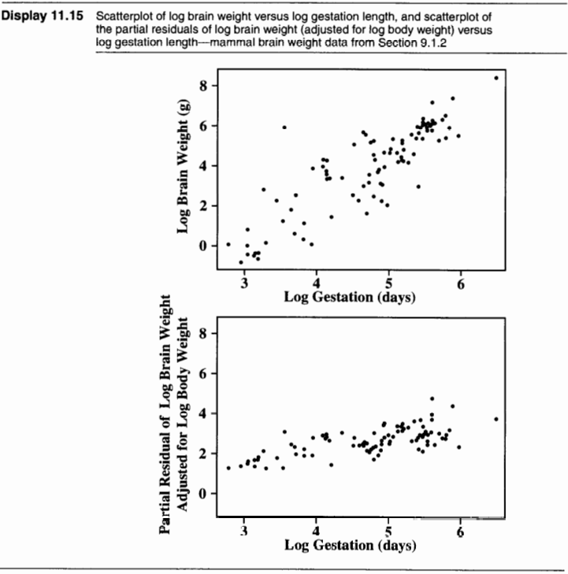

## Lab Objectives
* Partial Residual Plots

## Loading Data and Packages {auto-animate="true" auto-animate-easing="ease-in-out"}
```{r}
#| echo: TRUE
library(Sleuth3)
library(ggplot2)
library(car)
```

## Dataset {.smaller auto-animate="true" auto-animate-easing="ease-in-out"}
* `case0902` (Why Do Some Mammals Have Large Brains for Their Size?)
  * The data are the average values of brain weight, body weight, gestation lengths (length of pregnancy) and litter size for 96 species of mammals
  * 96 observations (rows)
  * 5 variables (columns)
    * `Species`: species name
    * `Brain`: average brain weight (in grams)
    * `Body`: average body weight (in kilograms)
    * `Gestation`: gestation period (in days)
    * `Litter`: average litter size

## Dataset {.smaller auto-animate="true" auto-animate-easing="ease-in-out"}
```{r}
#| echo: TRUE
case0902
```

## Dataset {.smaller auto-animate="true" auto-animate-easing="ease-in-out"}
```{r}
#| echo: TRUE
# Natural logging all variables
Data <- apply(case0902[, 2:5], 2, function(x) log(x))
colnames(Data) <- paste("log", colnames(Data), sep = "_")
```

## Visualizing Dataset {.smaller auto-animate="true" auto-animate-easing="ease-in-out"}
```{r}
#| echo: TRUE
# Looking at all pariwise scatterplots
pairs(Data)
```

## Partial Residual Plot {.smaller auto-animate="true" auto-animate-easing="ease-in-out"}



## Partial Residual Calculations {.smaller auto-animate="true" auto-animate-easing="ease-in-out"}

$$
\begin{align*}
\mu \left( \log(\text{Brain}) \mid \log(\text{Body}), \log(\text{Gestation}) \right) & = \beta_0 + \beta_1 \log(\text{Body}) \\
& \quad + \beta_2 \log(\text{Gestation})
\end{align*}
$$

## Partial Residual Calculations {.smaller auto-animate="true" auto-animate-easing="ease-in-out"}
```{r}
#| echo: TRUE
# Creating full model
case0902_lm2 <- lm(log(Brain) ~ log(Body) + log(Gestation), data = case0902)
```

## Partial Residual Calculations {.smaller auto-animate="true" auto-animate-easing="ease-in-out"}
```{r}
#| echo: TRUE
summary(case0902_lm2)
```

## Partial Residual Calculations {.smaller auto-animate="true" auto-animate-easing="ease-in-out"}

$$
\text{Partial Residual}_i = \log(\text{Brain}_i) - \left( \hat{\beta}_0 + \hat{\beta}_1 \log(\text{Body}_i) \right)
$$

## Partial Residual Plots {.smaller auto-animate="true" auto-animate-easing="ease-in-out"}
```{r}
#| echo: TRUE
#| output-location: fragment
# From `car` library
crPlot(case0902_lm2, variable = "log(Gestation)")
```

## Partial Residual Plots {.smaller auto-animate="true" auto-animate-easing="ease-in-out"}
```{r}
#| echo: TRUE
#| output-location: fragment
# From `car` library
crPlot(case0902_lm2, variable = "log(Body)")
```

## Partial Residuals {.smaller auto-animate="true" auto-animate-easing="ease-in-out"}
* The book (The Sleuth) describes the purpose of partial residual plots as such
  * "The idea behind a partial residual plot is to approximate [some function of an explanatory variable] with the linear function [$\beta_{i}X$]"
  * `crPlot` calculates them by

::: {.fragment}
$$
\text{Partial Residual}_i = \text{Residual}_{i} + \hat{\beta}_{2}\log\left(\text{Gestation}_{i}\right)
$$

:::

## Partial Residuals {.smaller auto-animate="true" auto-animate-easing="ease-in-out"}
* We are essentially trying to understand the relationship between an explanatory variable and the response, controlling for the other explanatory variables in the model.

<!-- ## Dataset {.smaller auto-animate="true" auto-animate-easing="ease-in-out"} -->
<!-- * `ex0915` (Rainfall and Corn Yield) -->
<!--   * Data on corn yield and rainfall in six U.S. corn–producing states (Iowa, Nebraska, Illinois, Indiana, Missouri and Ohio), recorded for each year from 1890 to 1927. -->
<!--   * 38 observations (rows) -->
<!--   * 3 variables (columns) -->
<!--     * `Year`: year of observation (1890–1927) -->
<!--     * `Yield`: average corn yield for the six states (in bu/acre) -->
<!--     * `Rainfall`: average rainfall in the six states (in in/year) -->

## Dataset {.smaller auto-animate="true" auto-animate-easing="ease-in-out"}
```{r}
#| echo: TRUE
ex0915
```

## Visualizing Dataset {.smaller auto-animate="true" auto-animate-easing="ease-in-out"}
```{r}
#| echo: TRUE
pairs(ex0915)
```

## Example 1 {.smaller auto-animate="true" auto-animate-easing="ease-in-out"}
```{r}
#| echo: TRUE
yield_lm <- lm(Yield ~ Rainfall + Year, data = ex0915)
```

## Example 1 {.smaller auto-animate="true" auto-animate-easing="ease-in-out"}
```{r}
#| echo: TRUE
crPlot(yield_lm, variable = "Rainfall")
```

## Example 2 {.smaller auto-animate="true" auto-animate-easing="ease-in-out"}
```{r}
#| echo: TRUE
ex1122
```

## Example 2 {.smaller auto-animate="true" auto-animate-easing="ease-in-out"}
```{r}
#| echo: TRUE
deforest_lm <- lm(Deforest ~ Debt + Pop, data = ex1122)
```

## Example 2 {.smaller auto-animate="true" auto-animate-easing="ease-in-out"}
```{r}
#| echo: TRUE
crPlot(deforest_lm, variable = "Debt")
```

## [Difference Between Residual Calculations]{.r-fit-text} {.smaller auto-animate="true" auto-animate-easing="ease-in-out"}
```{r}
#| echo: TRUE
# Showing that the way you calculate the partial residuals matters
mtcars
```

## [Difference Between Residual Calculations]{.r-fit-text} {.smaller auto-animate="true" auto-animate-easing="ease-in-out"}
```{r}
#| echo: TRUE
# Example linear model
model <- lm(mpg ~ hp + wt, data = mtcars)
```

## [Difference Between Residual Calculations]{.r-fit-text} {.smaller auto-animate="true" auto-animate-easing="ease-in-out"}
```{r}
#| echo: TRUE
# Example linear model
model <- lm(mpg ~ hp + wt, data = mtcars)

# Get the fitted values and residuals
fitted_values <- fitted(model)
residuals <- residuals(model)
```

## [Difference Between Residual Calculations]{.r-fit-text} {.smaller auto-animate="true" auto-animate-easing="ease-in-out"}
```{r}
#| echo: TRUE
# Example linear model
model <- lm(mpg ~ hp + wt, data = mtcars)

# Get the fitted values and residuals
fitted_values <- fitted(model)
residuals <- residuals(model)

# Get the coefficients
coefficients <- coef(model)

# Select the predictor for which to compute partial residuals (e.g., "hp")
X_hp <- mtcars$hp  # Predictor variable for horsepower
```

## [Difference Between Residual Calculations]{.r-fit-text} {.smaller auto-animate="true" auto-animate-easing="ease-in-out"}
```{r}
#| echo: TRUE
# Calculate the partial residuals for 'hp' (method 1)
partial_residual_hp <- residuals + coefficients["hp"] * X_hp

# Calculate the other way (method 2)
partial2_residual_hp <- mtcars$mpg - coefficients["(Intercept)"] - coefficients["hp"] * X_hp
```

## [Difference Between Residual Calculations]{.r-fit-text} {.smaller auto-animate="true" auto-animate-easing="ease-in-out"}
```{r}
#| echo: TRUE
# Create a data frame for ggplot
partial_residuals_df <- data.frame(
  hp = X_hp,
  partial_residual1 = partial_residual_hp,
  partial_residual2 = partial2_residual_hp
)
```

## [Difference Between Residual Calculations]{.r-fit-text} {.smaller auto-animate="true" auto-animate-easing="ease-in-out"}
```{r}
#| echo: TRUE
#| output-location: fragment
# Plotting both methods of partial residuals
ggplot(partial_residuals_df, aes(x = hp)) +
  geom_point(aes(y = partial_residual1), color = "blue", alpha = 0.6) +
  geom_line(aes(y = partial_residual1), color = "lightblue") +
  geom_point(aes(y = partial_residual2), color = "red", alpha = 0.6) +
  geom_line(aes(y = partial_residual2), color = "lightpink") +
  labs(title = "Comparison of Two Methods for Partial Residuals",
       x = "Horsepower",
       y = "Partial Residuals") +
  theme_minimal() +
  theme(legend.position = "none")
```


