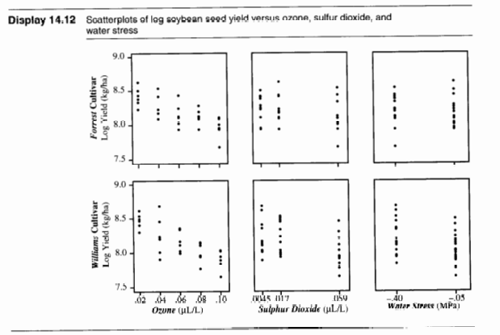
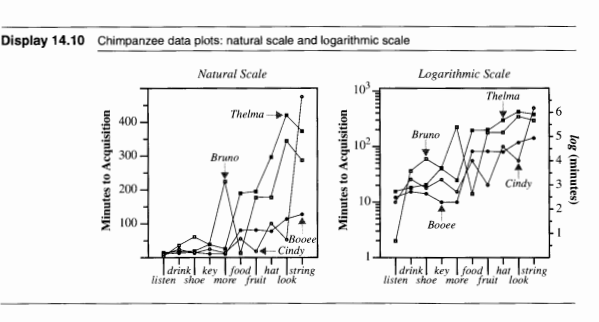

```{r}
#| echo: FALSE
setwd("C:/Users/Ghcto/OneDrive/Desktop/School/Year 2/Winter 2025/ST 512 (TA)/Labs/Lab 9")
```

## Lab Objectives
* We're just doing some usual plotting today...
  * In order to plot we'll go over some data manipulation functions and uses

## Loading Data and Packages {auto-animate="true" auto-animate-easing="ease-in-out"}
```{r}
#| echo: TRUE
library(Sleuth3)
library(ggplot2)
library(tidyr)   # Tidyverse data manipulation options
library(dplyr)   # Tidyverse data manipulation options
library(forcats) # Helper functions for reordering factor levels
```

## Dataset {.smaller auto-animate="true" auto-animate-easing="ease-in-out"}
* `case1402` (Effect of Ozone, SO2 and Drought on Soybean Yield)
  * In a completely randomized design with a 2x3x5 factorial treatment structure, researchers randomly assigned one of 30 treatment combinations to open-topped growing chambers, in which two soybean cultivars were planted. The responses for each chamber were the yields of the two types of soybean.
  * 30 observations (rows)
  * 5 variables (columns)
    * `Stress`: a factor indicating treatment, with two levels "Well-watered" and "Stressed"
    * `SO2`: a quantitative treatment with three levels 0, 0.02 and 0.06
    * `O3`: a quantitative treatment with five levels 0.02, 0.05, 0.07, 0.08 and 0.10
    * `Forrest`: the yield of the Forrest cultivar of soybean (in kg/ha)
    * `William`: the yield of the Williams cultivar of soybean (in kg/ha)

## Viewing Data {auto-animate="true" auto-animate-easing="ease-in-out"}
```{r}
#| echo: TRUE
case1402
```

## Viewing Data {auto-animate="true" auto-animate-easing="ease-in-out"}
```{r}
#| echo: TRUE
str(case1402)
```

## Want to Create {auto-animate="true" auto-animate-easing="ease-in-out"}


## Manipulating Data {auto-animate="true" auto-animate-easing="ease-in-out"}
```{r}
#| echo: TRUE
case1402_long1 <- pivot_longer(case1402,
                               cols = c("Forrest", "William"),
                               names_to = "Cultivar",
                               values_to = "Yield")
```

## Manipulating Data {auto-animate="true" auto-animate-easing="ease-in-out"}
```{r}
#| echo: TRUE
case1402_long1 <- pivot_longer(case1402,
                               cols = c("Forrest", "William"),
                               names_to = "Cultivar",
                               values_to = "Yield")
head(case1402_long1)
```

## Manipulating Data {.barelysmaller auto-animate="true" auto-animate-easing="ease-in-out"}
:::: {.columns}

::: {.column width="50%"}
```{r}
#| echo: TRUE
head(case1402)
```
:::

::: {.column width="50%"}
```{r}
#| echo: TRUE
head(case1402_long1)
```
:::

::::

## Manipulating Data {.barelysmaller auto-animate="true" auto-animate-easing="ease-in-out"}
* Uses `pivot_longer()` to reshape the `case1402` dataset from wide format to long format.  
* Converts the columns `"Forrest"` and `"William"` (which contain yield data for different cultivars) into a single column named `"Cultivar"`.  
* Stores the corresponding values in a new column named `"Yield"`.

## Plotting {auto-animate="true" auto-animate-easing="ease-in-out"}
```{r}
#| echo: TRUE
#| output-location: fragment
ggplot(data = case1402_long1, aes(x = SO2, y = Yield, 
                                  shape = Stress, color = Cultivar)) +
  geom_point()
```

## Manipulating Data {auto-animate="true" auto-animate-easing="ease-in-out"}
```{r}
#| echo: TRUE
case1402_long2 <- pivot_longer(case1402_long1, 
                               cols = c("SO2","O3"),
                               names_to = "Pollutant",
                               values_to = "Level")
```

## Manipulating Data {auto-animate="true" auto-animate-easing="ease-in-out"}
```{r}
#| echo: TRUE
case1402_long2 <- pivot_longer(case1402_long1, 
                               cols = c("SO2","O3"),
                               names_to = "Pollutant",
                               values_to = "Level")
head(case1402_long2)
```

## Manipulating Data {.barelysmaller auto-animate="true" auto-animate-easing="ease-in-out"}
:::: {.columns}

::: {.column width="50%"}
```{r}
#| echo: TRUE
head(case1402_long1)
```
:::

::: {.column width="50%"}
```{r}
#| echo: TRUE
head(case1402_long2)
```
:::

::::

## Plotting {auto-animate="true" auto-animate-easing="ease-in-out"}
```{r}
#| echo: TRUE
#| output-location: fragment
ggplot(data = case1402_long2, aes(x = Level, y = Yield, 
                                  shape = Pollutant, color = Stress)) +
  geom_point() + 
  coord_trans(y = "log") + 
  scale_x_continuous(breaks = unique(case1402_long2$Level))
```

## Plotting {auto-animate="true" auto-animate-easing="ease-in-out"}
```{r}
#| echo: TRUE
#| output-location: fragment
ggplot(data = case1402_long2, aes(x = Level, y = Yield, color = Stress)) + 
  geom_point() + 
  coord_trans(y = "log") + 
  facet_grid(Cultivar ~ Pollutant, scales = "free")
```

## Plotting {auto-animate="true" auto-animate-easing="ease-in-out"}
```{r}
#| echo: TRUE
#| output-location: fragment
ggplot(data = case1402_long2, aes(x = Level, y = Yield, color = Stress)) + 
  geom_point(position = "jitter") + 
  coord_trans(y = "log") + 
  facet_grid(Cultivar ~ Pollutant, scales = "free")
```

## Plotting {auto-animate="true" auto-animate-easing="ease-in-out"}
```{r}
#| echo: TRUE
#| output-location: fragment
ggplot(data = case1402_long2, aes(x = Level, y = Yield, color = Stress)) + 
  geom_point(position = "jitter") + 
  coord_trans(y = "log") + 
  facet_grid(Cultivar ~ Pollutant, scales = "free") + 
  theme(axis.text.x = element_text(angle = 90, hjust = 1)) +
  xlab(paste0("\U03BC","L/L")) +
  ylab("Yield (log scale)")
```

## Want to Create {auto-animate="true" auto-animate-easing="ease-in-out"}



## Viewing Data {auto-animate="true" auto-animate-easing="ease-in-out"}
```{r}
#| echo: TRUE
case1401
```

## Manipulating Data {auto-animate="true" auto-animate-easing="ease-in-out"}
```{r}
#| echo: TRUE
group_by(case1401, Sign)
case1401_1 <- group_by(case1401, Sign)
```

## Manipulating Data {auto-animate="true" auto-animate-easing="ease-in-out"}
```{r}
#| echo: TRUE
mutate(case1401_1, Mean_Time = mean(Minutes))
case1401_2 <- mutate(case1401_1, Mean_Time = mean(Minutes))
```

## Manipulating Data {auto-animate="true" auto-animate-easing="ease-in-out"}
```{r}
#| echo: TRUE
ungroup(case1401_2)
case1401_3 <- ungroup(case1401_2)
```

## Manipulating Data {auto-animate="true" auto-animate-easing="ease-in-out"}
```{r}
#| echo: TRUE
mutate(case1401_3, Sign = fct_reorder(Sign, Mean_Time))
case1401_4 <- mutate(case1401_3, Sign = fct_reorder(Sign, Mean_Time))
```

## Plotting {auto-animate="true" auto-animate-easing="ease-in-out"}
```{r}
#| echo: TRUE
#| output-location: fragment
ggplot(data = case1401_4, aes(x = Sign, y = Minutes, shape = Chimp)) + 
  geom_point() + 
  theme(axis.text.x = element_text(angle = 90, hjust = 1)) +
  geom_line(aes(group = Chimp, linetype = Chimp))
```

## Manipulating Data {auto-animate="true" auto-animate-easing="ease-in-out"}
```{r}
#| echo: TRUE
# Doing it all at once
case1401 %>% 
  group_by(Sign) %>% 
  mutate(Mean_Time = mean(Minutes)) %>%  
  ungroup() %>% 
  mutate(Sign = fct_reorder(Sign, Mean_Time)) -> case1401_4
```

```{r}
#| echo: FALSE
case1401 %>% 
  group_by(Sign) %>% 
  mutate(Mean_Time = mean(Minutes)) %>%  
  ungroup() %>% 
  mutate(Sign = fct_reorder(Sign, Mean_Time))
```

## Manipulating Data {auto-animate="true" auto-animate-easing="ease-in-out"}
```{r}
#| echo: TRUE
# Doing it all at once
case1401 %>% 
  group_by(Sign) %>% 
  mutate(Mean_Time = mean(Minutes)) %>%  
  ungroup() %>% 
  mutate(Sign = fct_reorder(Sign, Mean_Time)) %>%
  ggplot(aes(x = Sign, y = Minutes)) +
  geom_point(aes(shape = Chimp)) + 
  geom_line(aes(group = Chimp, linetype = Chimp)) + 
  theme(axis.text.x = element_text(angle = 90, hjust = 1))
```